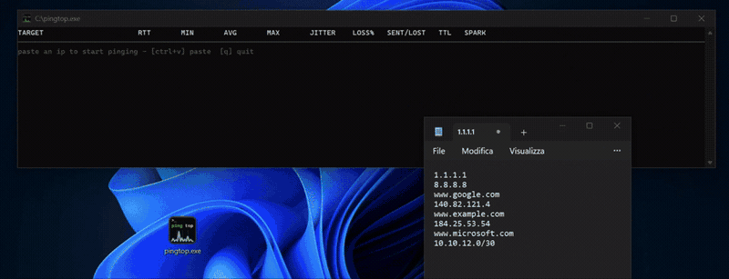

# pingtop (Windows fork)

> This is a fork of [ilguerro/pingtop](https://github.com/ilguerro/pingtop),
> modified to run natively on Windows without requiring Administrator
> privileges. See [Changes from upstream](#changes-from-upstream) below.

`pingtop` is a terminal dashboard that continuously pings one or more targets
and shows live RTT, smoothed jitter, packet loss, sent/lost counts, TTL, and a
sparkline per row in a sortable table. It takes IPs, hostnames, and CIDR
ranges as arguments.



## Changes from upstream

This fork **only targets Windows** and diverges from the original project in
a few significant ways:

- **ICMP implementation replaced.** The original uses raw/unprivileged ICMP
  sockets via [pro-bing](https://github.com/prometheus-community/pro-bing),
  which works well on Linux/macOS but requires Administrator privileges on
  Windows. This fork calls Windows' `IcmpSendEcho` (`iphlpapi.dll`) directly
  via syscalls instead — no elevation needed, IPv4 only.
- **Optional startup.** The program can now start with no target arguments
  and stay in an empty, waiting state.
- **Clipboard paste (`ctrl+v`).** Paste one or more IPs/hostnames/CIDRs from
  the system clipboard to start pinging them; pasting an already-tracked
  target removes it instead (add/remove toggle). Multi-line pastes are
  supported.
- **Runtime target management.** `C` clears all targets (stops every
  pinger); `R` resets each target's stats/history in place without dropping
  the connection.
- **New `TTL` column**, and a `t` key to toggle the SPARK column between
  Unicode block characters and a plain-ASCII rendering (useful on Windows
  Console Host configurations where the Unicode glyphs don't render).
- **Timed-out rounds are now visible.** A ping round with no reply marks the
  row's RTT/JITTER cells critical (red) while still showing the last known
  values, instead of silently leaving stale data on screen.
- Duration formatting throughout is fixed to always render in milliseconds
  (never falling back to seconds for an exact-zero value) with AVG/JITTER
  capped at 2 decimal places.

Everything else — the core UI layout, sorting, filtering, CIDR expansion,
and general design — comes from the original project.

## Usage

```
pingtop [flags] [target...]
```

Targets may be IPs, hostnames, or CIDR ranges — all optional; run with none
to start empty and add targets via `ctrl+v` once the UI is up.

## Keys

| Key                  | Action                                                                                                           |
| -------------------- | ------------------------------------------------------------------------------------------------------------------ |
| `↑` / `↓`, `k` / `j` | Scroll the table                                                                                                 |
| `s` / `S`            | Cycle the sort column forward (`s`) or backward (`S`) among visible columns; past the last entry clears the sort |
| `r`                  | Reverse the sort direction (no-op when unsorted)                                                                 |
| `/`                  | Start a live filter                                                                                              |
| `enter`              | Apply the filter (stay filtered, exit edit mode)                                                                 |
| `esc`                | Clear an active filter                                                                                           |
| `ctrl+v`             | Paste target(s) from clipboard — pasting an existing target removes it                                          |
| `C`                  | Clear all targets                                                                                                |
| `R`                  | Reset stats for all targets (keeps them running)                                                                 |
| `t`                  | Toggle SPARK column between Unicode and ASCII rendering                                                          |
| `q` / `ctrl-c`       | Quit                                                                                                              |

## Terminal setup tips

**Windows Terminal:** if `ctrl+v` doesn't paste a target, Windows Terminal
itself is intercepting the shortcut for its own clipboard paste before
pingtop ever sees it. Go to **Settings → Actions**, find the `ctrl+v` key
binding, and remove it. This frees the shortcut so pingtop receives it as a
normal key event.

**Windows Console Host (`conhost.exe`, classic `cmd.exe`):** the default
font doesn't cover the Unicode block characters used by the SPARK column,
which then render as boxes. For the best look, set the console font to
**Cascadia Code** (Properties → Font). Alternatively, press `t` inside
pingtop to switch SPARK to a plain-ASCII rendering that works with any font.


## Build from source

Requires Go 1.26+.

```
git clone <this-repo-url>
cd pingtop
go mod tidy
GOOS=windows GOARCH=amd64 go build -o pingtop.exe .
```

## Privileges

No Administrator privileges required — `IcmpSendEcho` works for any
unprivileged Windows user by design.

## License

Apache 2.0, inherited from the upstream project. See [LICENSE](LICENSE).
Copyright for the original work belongs to Riccardo Guerriero; this fork's
modifications are licensed under the same terms.
